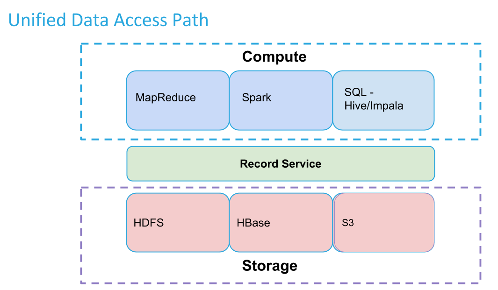
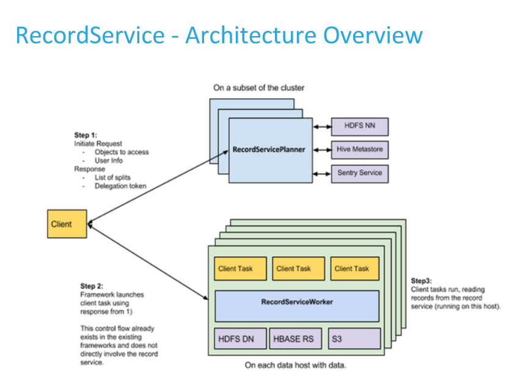

RecordService provides an abstraction layer between compute frameworks and data storage. It provides row- and column-level security, and other advantages as well.

## The Impetus

The Sentry community considered how to enforce a common set of column-level authorization permissions across Hadoop. Building Sentry support into each Hadoop component as well as various applications that interact with Hadoop would require massive effort and continual maintenance.

Instead, the community conceived the idea of a common API for accessing tabular data as _records_ &mdash; a unified data access path that can be used by multiple Hadoop components and applications with minimal code changes.

{:height="85%" width="85%"}

## The Benefits
* RecordService provides fine-grained data permissions and enforcement across Hadoop.
* Clients work independent of on-disk storage format.
* The unified data access path provides a single place to implement and test file format-related changes.
* Components swap transparently above or below RecordService.
* Performance is boosted via Impala’s optimized scanner, dynamic code generation, and parquet implementation.
* Existing MapReduce and Spark jobs gain Impala-quality performance.
* Make projections over original source datasets instead of making copies/subsets.

## The Design
RecordService provides the following services.

* RecordServicePlanner &mdash; Generates tasks, performs authorization checks, handles metadata access. Called during input split generation. 
* RecordServiceWorker &mdash; Executes tasks, reads and writes to the storage layer.
    * Builds on Impala’s highly optimized I/O scheduler and file parsers.
    * Returns rows in a canonical format.
* Thrift APIs.
* Client Integration Libraries &mdash; Allow easy migration to RecordService.

{:height="85%" width="85%"}

[morphlines-intro]: {{site.baseurl}}/morphlines/

